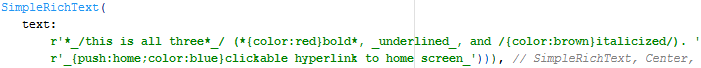

# simple_rich_text

Easily format Flutter text with simple format characters.

Motivation: lowest-possible development friction to add color and formatting to text.

In comparison, [easy_rich_text](https://pub.dev/packages/easy_rich_text) requires lots of code (i.e, patternList of EasyRichTextPattern objects). 


# Format Characters

These are non-standard (*not* markdown compatible) but are more intuitive, in my opinion:

| format character      | format effect                | simple_rich_text string input | Flutter output |
|-----------|----------------------|----------------------|----------------------|
| asterisk (*)       | bold            | "this is \*bold\*" | this is **bold** |
| slash (/)       | italics            | "this is /italicized/" |this is *italicized* |
| underscore (_)       | underline            | "this is \_underlined\_" |this is <ins>underlined</ins> |


## Example Input
```
SimpleRichText(r'*_/this is all three*_/ (*{color:red}bold*, _{color:green}underlined_, and /{color:brown}italicized/). _{push:home;color:blue}clickable hyperlink to home screen_')
```

## Example Flutter Output


 


# Attributes

Attribute pairs are placed in curly brackets immediately after first character marker.
Each pair is separated by a semicolon (;) and can be in any order.
Each pair has syntax *name:value*.


| key      | meaning                | implemented Dart code |
|-----------|----------------------|----------------------|
| color   | red, blue, etc           | textStyle.color: *color-value* |
| pop       | pop the navigation stack            |  Navigator.pop(context);  |
| push       | push the value onto the navigation stack            | Navigator.pushNamed(context, '/$route');  |
| repl       | replace the top route on the navigation stack            | Navigator.popAndPushNamed(context, '/$route');  |


# Colors Supported

Change text color by passing color as attribute:

## Example
```
"this is blue hyperlink to the _{color:blue,push:calendar}calendar_ screen"
```

| color:color_value      | hex value |
|-----------|-----------|
| aqua | 0x00FFFF |
| black | 0x000000 |
| blue | 0x0000FF |
| brown | 0x9A6324 |
| cream | 0xFFFDD0 |
| cyan | 0x46f0f0 |
| green | 0x00FF00 |
| gray | 0x808080 |
| grey | 0x808080 |
| mint | 0xAAFFC3 |
| lavender | 0xE6BEFF |
| new | 0xFFFF00 |
| olive | 0x808000 |
| orange | 0xFFA500 |
| pink | 0xFFE1E6 |
| purple | 0x800080 |
| red | 0xFF0000 |
| silver | 0xC0C0C0 |
| white | 0xFFFFFF |
| yellow |0xFFFF00 |


# Features

- support text hyperlinks to other screens by preceding formatted text with route inside curly brackets:  e.g., "... _{calendar}go to calendar screen_".


# Sample Inputs:
```
'this is /italic/'

'this is *bold*'

'*_/this is all three*_/ (*bold*, _underlined_, and /italicized/)'

'you can quote characters to NOT format a word \*bold\*'

'this is _underline_'

'go to _{/myroute}home_ page'

'this is ~important~(red).'

'this is _*bold and underlined*_.'
```


# Notes

You can use multiple characters at the same time:
```
"this is _/underlined and italicized/_"
```

You can be sloppy!  Unlike HTML, for convenience, if using multiple characters the open and closed sequences, they _don't_ need to be in exact palindrome matching order:

```
"these are */equivalent/* and works without problems."
"these are */equivalent*/ and works without problems."
```


# Requirements
Ancestor MUST have textDirection set (required by internal RichText widget), either through MaterialApp widget or explicitly wrapped by a Directionality widget:
```
Directionality(
    child: SimpleRichText('Peter', term: 't'),
    textDirection: TextDirection.ltr)
```


# Improvements, Bugs, and Deficiencies

- [ ] user-definable format characters
- [ ] user-definable callback functions for custom formatting
- [ ] support non-named navigation (only pushNamed, etc., supported at present)  


# Pull Requests
Pull requests are welcome!


# Examples

See the example directory.