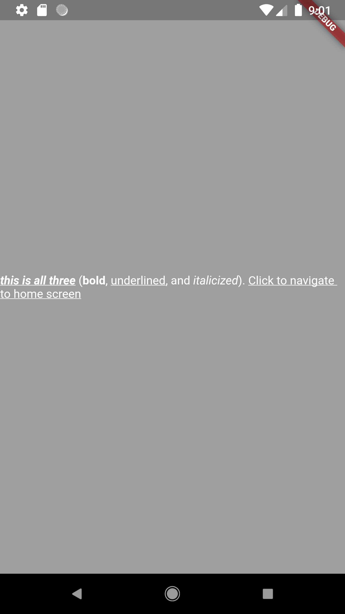

# Example

```
import 'package:simple_rich_text/simple_rich_text.dart';
import 'package:flutter/material.dart';

void main() {
  WidgetsFlutterBinding.ensureInitialized();
  runApp(new MyApp());
}

class MyApp extends StatelessWidget {
  @override
  Widget build(BuildContext context) {
    String text =
        r'*_/this is all three*_/ (*{color:red}bold*, _underlined_, and /{color:brown}italicized/). _{push:home;color:blue}clickable hyperlink to home screen_';
    return new MaterialApp(
      home: Scaffold(
          body: Center(
              child: SimpleRichText(text: text))),
    );
  }
}

```

# Output:

